# Smart Forms — User Guide

**Version 1.1.0**
**Applies to:** SharePoint Online

---

## Table of Contents

1. [Overview](#overview)
2. [Who Is This For?](#who-is-this-for)
3. [Getting Started](#getting-started)
4. [Building a Form](#building-a-form)
5. [Question Types](#question-types)
6. [Branching, Validation & More](#branching-validation--more)
7. [Form Settings](#form-settings)
8. [Templates](#templates)
9. [Publishing & Sharing](#publishing--sharing)
10. [The Filler Experience](#the-filler-experience)
11. [Results & Analytics](#results--analytics)
12. [Web Part Configuration](#web-part-configuration)
13. [Security & Permissions](#security--permissions)
14. [Frequently Asked Questions](#frequently-asked-questions)
15. [Troubleshooting](#troubleshooting)
16. [Limitations](#limitations)

---

## Overview

**Smart Forms** brings a Microsoft Forms-style experience directly into SharePoint. Form owners design forms visually — the canvas *is* the form, so what you see while editing is exactly what respondents see — share a single link, and watch responses land straight into a regular SharePoint or Microsoft Lists list with real columns.

That last part is what sets it apart from a standalone forms tool: your data was never locked away. It's a normal list, so it shows up in views, Power BI, Power Automate, and search like anything else in SharePoint — while Smart Forms itself gives you the design, distribution, and analysis layer on top.

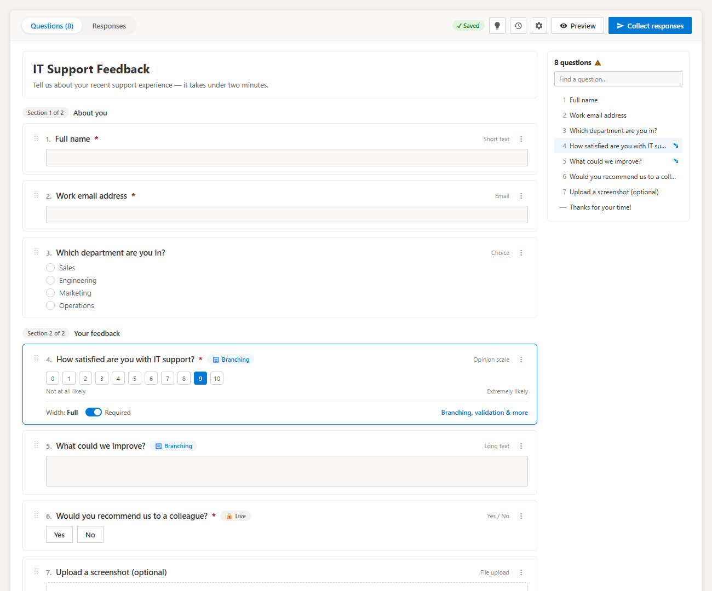

### What You Can Do

| Area | Purpose |
|---|---|
| **Designer** | Build a form with 24 question types, branching logic, validation, and eight starter templates |
| **Filler experience** | A themed, accessible, single-page or wizard form for respondents, with URL prefill and save-and-resume |
| **Results** | A dashboard with KPIs and charts, a segmentable summary view, a sortable response table, and per-response detail |

---

## Who Is This For?

- **Form owners** — anyone building an internal survey, request form, or registration page who wants a Microsoft Forms-like build experience without leaving SharePoint
- **Site owners** who want response data to live in a list they already control, rather than a separate tool
- **Analysts** who need a dashboard and segment-by-question breakdowns without exporting to Excel first
- **Respondents** — anyone filling in a shared form link; no SharePoint or Smart Forms knowledge required

> **Note:** The designer and results tabs only appear for people with **Manage Lists** permission on the response list. Everyone else — anyone who opens a share link — sees only the form itself. Smart Forms is an SPFx web part, so respondents must be **signed in**; anonymous access is not supported. Recipients need at least read access to the page's site plus permission to add items to the response list.

---

## Getting Started

### Prerequisites

- **Manage Lists** permission on the list the form's responses will be saved to, to design the form and view results
- **Add Items** permission on the response list, for anyone who needs to submit responses
- A SharePoint page you can edit, to place the web part on

### Adding the Web Part

1. Edit a SharePoint page and add the **Smart Forms** web part from the **Other** group in the web part picker.
2. In the property pane, pick an existing list to store responses in, or type a name and click **Create list** to create one without leaving the page.
3. Start building your form on the canvas, or click the lightbulb button to pick a starting template.

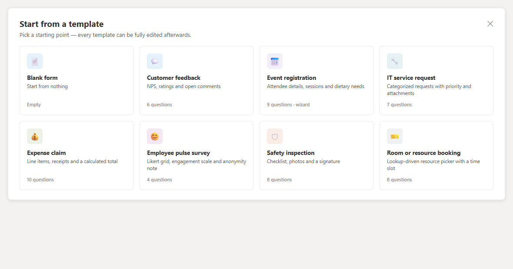

> **The form lives with the page.** SPFx keeps web part properties in memory until the page is saved, so **publish the page** after building your form — a form built and then abandoned without publishing is lost. Watch the save-state chip in the owner bar; it reads **Saved** once your changes are safely persisted, or **Saving…** while a save is in flight.

---

## Building a Form

The designer canvas is the form itself — there's no separate preview pane to switch to while you work.

- **Title and description** sit at the top of the canvas as plain editable text, not behind a settings panel.
- **Question cards** show a drag handle on the left; drag by the handle (or use the arrow keys on it) to reorder, including across section boundaries.
- Click a card to expand it: the title becomes an editable field, options and grid rows can be added or removed inline with **+** / **✕** buttons, and a footer appears with width, duplicate, delete, and a **Required** toggle.
- Every card's **⋯** menu has **Insert question below**, so a new question can be dropped in right after any existing one instead of always landing at the end.
- **Sections** group related questions under a heading and description; each section ends with an **Add new** button offering popular types, common presets, and the full type catalog grouped by category. An **Add section** action sits below the last section.
- On forms with more than a few questions, an **outline rail** appears on the right: a live table of contents showing each question's number, a truncated title, a branch icon where logic applies, and a warning icon for anything that needs attention. Search it to jump straight to a question.

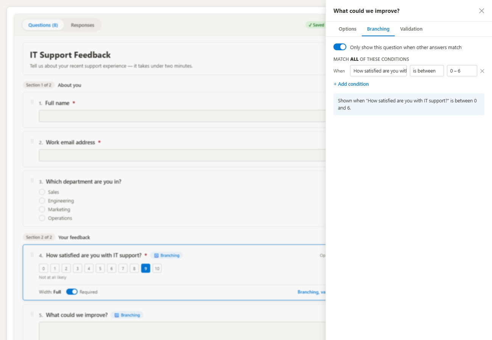

### Before You Collect Responses

Clicking **Collect responses** first runs a pre-flight check for empty option lists, broken calculation formulas, branching rules pointing at deleted questions, and unnamed questions. Each issue links straight to the question with a **Go to** jump, so nothing gets published half-finished by accident.

---

## Question Types

Smart Forms ships 24 question types, organized by category in the **Add new** menu:

| Category | Types |
|---|---|
| **Text** | Short text, long text, formatted (rich) text, email, phone, address, link |
| **Number** | Number (plain, currency, or percentage), calculated |
| **Choice** | Choice, image choice, lookup from another list, yes/no, consent |
| **Scales** | Rating, opinion scale, slider, Likert grid, ranking |
| **Date & time** | Date (with optional time), time |
| **People** | Person |
| **Advanced** | File upload, signature |
| **Layout** | Text block |

A few worth calling out:

- **Lookup from another list** pulls its options live from a column in a different SharePoint list — something a standalone forms tool structurally can't do.
- **Calculated** works out a read-only total from other answers (e.g. `{Quantity} * {Unit price}`), updating live as the respondent types.
- **Likert grid** renders as a real table — statements down the side, a shared scale across the top — ideal for satisfaction and engagement surveys.
- **Presets** (NPS 0–10, satisfaction 1–5, currency, percentage) are one-click starting configurations built on the general Number and Scale types, not separate types to remember.

Per-question settings — type-specific options, branching, and validation — live behind each card's **⋯ → Branching, validation & more**, split into three tabs (see next section).

---

## Branching, Validation & More

Opening a question's **⋯ → Branching, validation & more** slides in a panel with up to three tabs, depending on the question type:

### Options
Type-specific settings: number format and decimal places, the formula editor (with a live preview) for Calculated fields, min/max/step and endpoint labels for Slider and Opinion scale, icon style and half-value support for Rating, inline-vs-dropdown display and an "Other" write-in box for Choice, the source list/column/filter for Lookup, and so on.

### Branching
Toggle **Only show this question when other answers match**, then build a rule from one or more conditions joined by **AND** or **OR**. Operators include `is`, `is not`, `contains`, `is answered`, numeric `greater than` / `between`, and date `before` / `after`. As you build the rule, a plain-English sentence restates exactly what will happen — e.g. *"Shown when 'How satisfied are you with IT support?' is between 0 and 6."* — so there's no guessing what a saved rule actually does.

### Validation
Help text, placeholder text, a default answer, a custom required-message, a read-only toggle (pairs well with [URL prefill](#url-prefill)), and — for text and numeric types — a maximum length and a regex pattern with its own custom error message.

> A lock icon and hint appear at the bottom of the panel once a question's SharePoint column has already been provisioned, since a live column's type can no longer be changed in place.

---

## Form Settings

The gear button in the owner bar opens **Form settings**, a panel with five tabs (Notifications also holds the approval workflow, and Access holds "allow respondents to edit their response"):

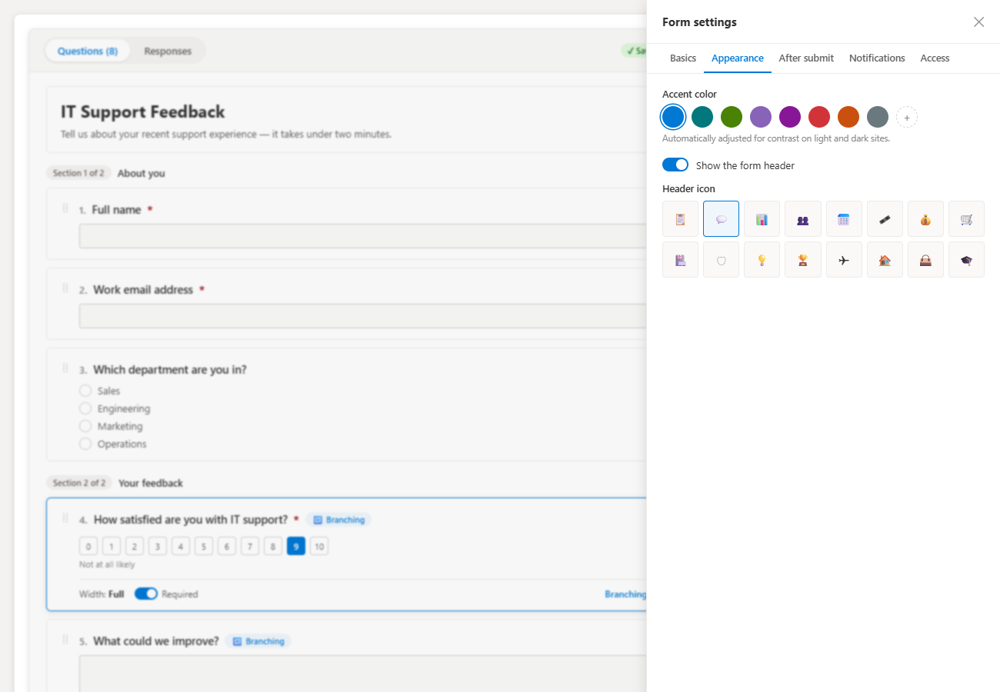

| Tab | Contains |
|---|---|
| **Basics** | Title, description, single-page or wizard layout, question numbering, question shuffling |
| **Appearance** | Accent color (eight presets plus a custom picker) and an optional header icon — every other color on the form derives from the site theme automatically, so it stays legible on light and dark sites |
| **After submit** | Submit button text, thank-you title and message, and whether to offer a "Submit another response" button |
| **Notifications** | Who gets emailed on each response, whether respondents get a copy of their own answers, **Enable approval workflow** and **Email respondent on decision** |
| **Access** | Open/close dates, a response cap, one-response-per-person, save-and-resume, **Allow respondents to edit their response**, and the message shown once the form is closed |

Notification emails go through SharePoint's own send-email API (`no-reply@sharepointonline.com`), so recipients must be users inside your Microsoft 365 organization — external addresses are silently dropped. A failed notification never blocks the response itself from being saved.

---

## Templates

Rather than starting from a blank canvas, the lightbulb button in the owner bar opens a gallery of eight complete, ready-to-edit forms:

| Template | What it demonstrates |
|---|---|
| **Blank form** | An empty canvas, for when you know exactly what you want |
| **Customer feedback** | NPS, ratings, and open comments (6 questions) |
| **Event registration** | Attendee details, sessions, and dietary needs — wizard layout (9 questions) |
| **IT service request** | Categorized requests with priority and attachments (7 questions) |
| **Expense claim** | Line items, receipts, and a calculated total (10 questions) |
| **Employee pulse survey** | A Likert grid, an engagement scale, and an anonymity note (4 questions) |
| **Safety inspection** | A checklist, photo uploads, and a signature (8 questions) |
| **Room or resource booking** | A lookup-driven resource picker with a time slot (8 questions) |

Every template is a fully real, complete form — pick one to start, then rename, add, remove, or rewire branching exactly as if you'd built it from scratch.

---

## Publishing & Sharing

Once your form is ready, click **Collect responses** (it becomes **Share** after the list columns exist). This provisions the response list's columns behind the scenes and opens a share dialog with a ready-to-copy link.

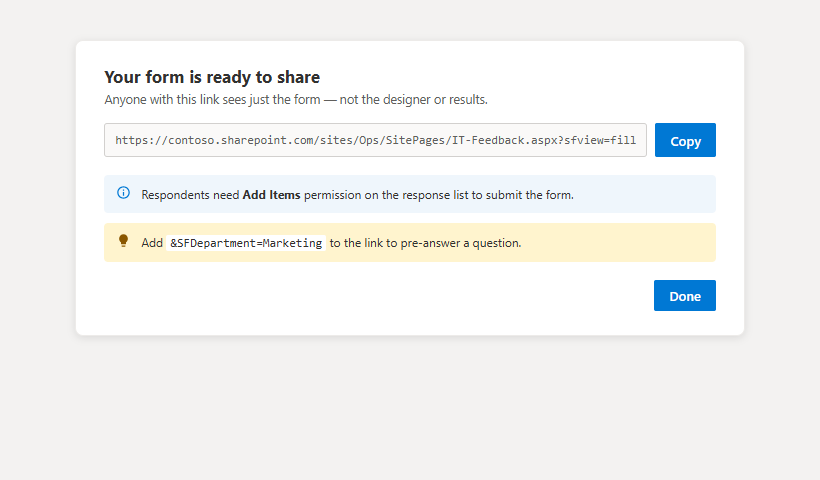

| Link | Behavior |
|---|---|
| The page's own URL | Owners see the designer and results; visitors see just the form |
| Page URL + `?sfview=fill` (what **Collect responses** copies) | Everyone, including owners, sees just the form — useful for testing exactly what a respondent sees |
| Share link + `&<ColumnName>=value` | Pre-answers a question using its internal column name |

### Sharing from Microsoft Teams

When the web part runs in a Teams tab, the share dialog builds the link from the SharePoint page URL rather than the Teams window, so it works when pasted anywhere. Recipients still need access to the site. If your browser blocks the Copy button, the link is selected for you to copy with Ctrl+C.

### URL Prefill

Add `&<ColumnName>=value` to a share link to pre-answer a question — for example `&SFDepartment=Finance`. Combine this with a question's **Read-only** validation setting to hand out links where a value is pre-filled and can't be changed, which is useful for department- or campaign-specific variants of the same form.

> **Prefill is not a security boundary.** Anyone with the link can edit the URL or, for editable questions, change the answer. Do not rely on a prefilled value (or a read-only question) to prove who someone is or to restrict access.

### Editing a Response

With **Allow respondents to edit their response** on, a respondent who opens the form again sees their own earlier submission and can update it. Each person can edit only responses they created.

### Approval Workflow

Turn on **Enable approval workflow** (Settings, Notifications) and publish again: approval columns are added to the response list. Owners then approve, reject or reset a response, with an optional comment, from the Responses tab (single or bulk). Switch on **Email respondent on decision** to notify the respondent when a decision is made (organization users only).

### Version History & Restore

The **History** button in the owner bar lists earlier saved versions of the form (date and author). Use **Preview** to see how many questions a version has, and **Restore** to load it into the designer after a confirmation. A banner offers **Undo restore**. Restoring changes the form definition only: new questions get list columns when you next use **Collect responses**, and columns for questions that exist now but not in the restored version remain in the list (their names are reserved so they are not reused). History needs versioning enabled on the hidden "Smart Forms Config" list (on by default when Smart Forms creates it); if it is unavailable the panel says so.

### Languages and Right-to-Left

The interface is translated into 30 languages and follows the language of the SharePoint page. Dates use the page culture. For Arabic, Hebrew, Persian and Urdu the whole web part mirrors to right-to-left automatically.

### Permissions Reminder

Respondents need **Add Items** permission on the response list to submit the form. This is by far the most common cause of "the form doesn't work for my colleagues" reports — the share dialog calls it out directly so it isn't missed.

---

## The Filler Experience

Respondents see a themed, accessible rendering of the form — every color derives from the site theme (and the owner's chosen accent, contrast-corrected automatically), so the form stays legible on both light and dark sites.

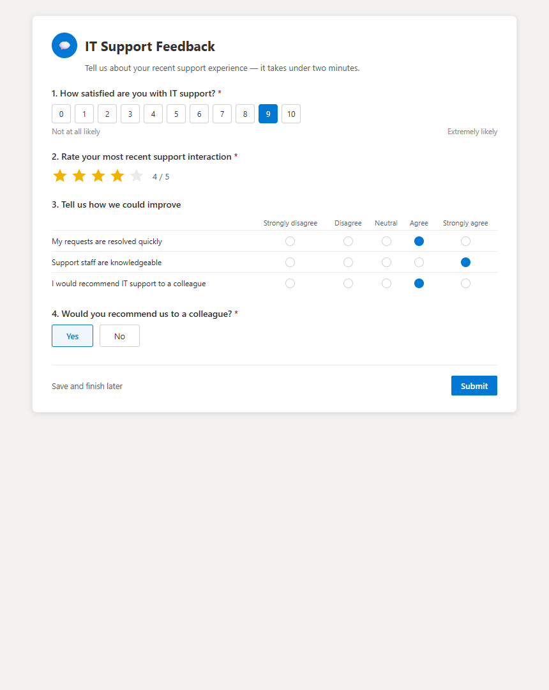

### Single-Page vs. Wizard

By default every section appears stacked on one page. Switch **Layout** to **wizard** in Form Settings → Basics to instead show one section per step, with clickable step markers, a progress bar, and validation per step before moving on.

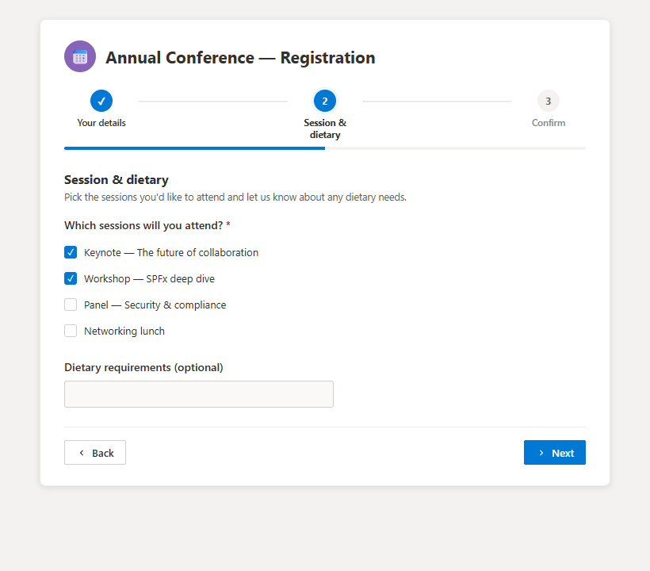

### Validation and Errors

Required fields, format checks (email/phone/URL), numeric and scale bounds, min/max selection counts, regex patterns, and file type/size limits are all enforced before submit. A failed submission shows an error summary banner listing every problem question with a jump link, and moves focus to the first one.

### Save and Resume

If enabled in Form Settings → Access, respondents can save a partial response and finish it later from the same link, rather than losing their progress. This is only available on single-page forms.

### Confirmation

After submitting, respondents see a confirmation screen with the owner's custom thank-you title and message, and — if enabled — a button to submit another response.

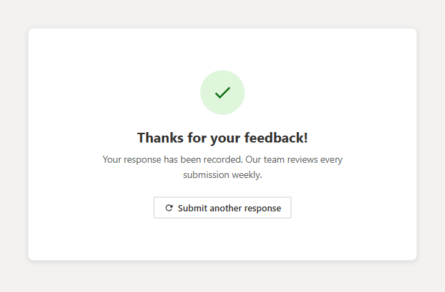

### Previewing Without Polluting Data

The **Preview** button in the owner bar shows exactly what a respondent will see, including live validation and branching — but nothing typed there is saved to the response list. A banner across the top of the preview makes this explicit.

---

## Results & Analytics

The **Responses** tab (owners only) has four views: **Dashboard**, **Summary**, **Table**, and **Individual**.

### Dashboard

The default view: a KPI strip (total responses, last-7-days with a week-on-week delta, today, unique respondents, completion rate, and median time to complete), a responses-over-time chart you can switch between day/week/month granularity, and a set of **highlight tiles** the app auto-selects — typically the most lopsided choice question, the lowest-scoring rating, and the widest-spread numeric field — so the dashboard is useful before you configure anything.

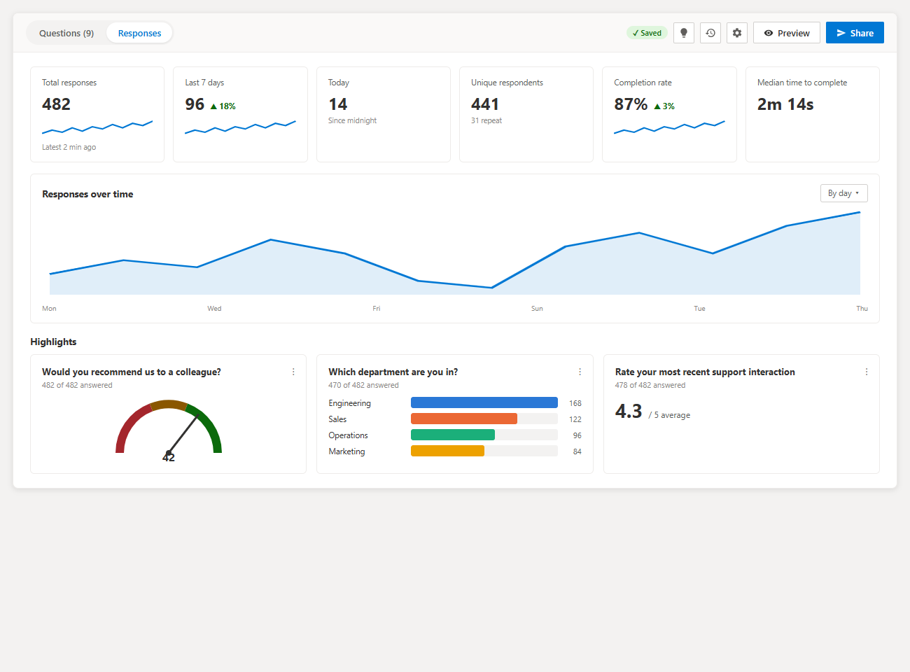

Every tile's **⋯** menu lets an owner pin, hide, reorder, and re-chart it — bar, column, donut, gauge, histogram, statistics, word frequency, or table — and the layout is saved with the form.

### Summary

The same per-question cards as the dashboard, but for every question rather than just the highlights, with one addition: **Compare by**. Pick any Choice, Yes/No, Person, or rating question as a segment, and every card re-renders split by that segment — "NPS by department," "satisfaction by region" — without leaving the page.

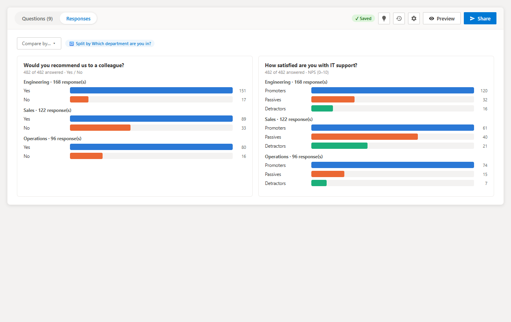

### Table

Every question is available as a column, with a picker to choose which ones show and in what order. Columns are sortable, rows are virtualized for large response sets, and a search box and date/answer filters — shared with the Dashboard and Summary views, so all three views always report the same numbers — narrow the table down. Multi-select rows for bulk export or delete.

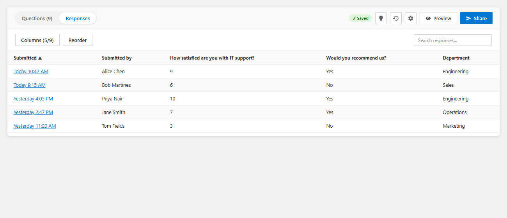

### Individual

Step through responses one at a time with Prev/Next, either as a labelled list of question/answer pairs or rendered as the form itself (read-only) — the latter is far more legible for forms with many questions. Attachment links, signature previews, and a print-friendly layout are all included.

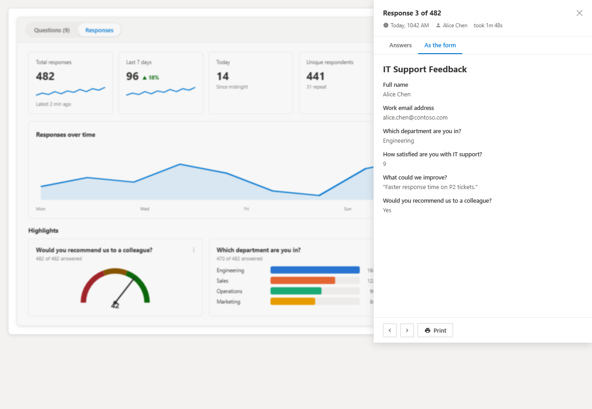

### Exporting

A one-click **CSV export** covers the current filtered set, Excel-ready with a UTF-8 byte-order mark and formula-injection guarding. There is no built-in Excel `.xlsx` or PDF export — see [Limitations](#limitations).

### Email Notifications

Every response can be emailed to a chosen list of recipients, formatted with the full set of answers and a **View in Microsoft Lists** link — no Power Automate flow or premium connector required. Respondents can optionally be sent a copy of their own answers too.

---

## Web Part Configuration

Almost everything about a Smart Forms instance is edited in place on the page — the property pane's only job is picking the response list.

| Setting | Description |
|---|---|
| **Save responses to this list** | A dropdown of the site's visible generic lists |
| **Or create a new list** | Type a name and click **Create list** to create and select a list without leaving the page |

To change the response list after a form has been built, put the page in edit mode, click the web part's pencil icon, and choose a different list — note that a form's questions are provisioned as columns on whichever list is selected when **Collect responses** is clicked, so switching lists after publishing does not move existing columns or data.

---

## Security & Permissions

| Property | Detail |
|---|---|
| **Runs as the signed-in user** | All reads and writes use the current user's own SharePoint permissions — the web part has no elevated access of its own |
| **Designer and results are gated** | Only users with **Manage Lists** on the response list see the Questions and Responses tabs; everyone else sees only the form |
| **Submissions require Add Items** | Respondents need this right on the response list to submit; the share dialog reminds owners of this |
| **Sign-in required** | The web part runs only for signed-in users; there is no anonymous access. Share-link recipients need at least read access to the site |
| **Access rules are form-enforced, not SharePoint-enforced** | Open/close dates, response caps, and one-response-per-person are all applied by the form's own logic — someone with direct Add Items access to the list could still add an item without going through these rules |
| **Prefill is not a security boundary** | URL prefill values are ordinary query-string text that the recipient can change |
| **Rich text is sanitized on display** | Smart Forms' own rendering strips unsafe markup from stored rich-text answers before showing them |

---

## Frequently Asked Questions

**Q: My form disappeared after I built it. What happened?**
A: The page was never saved after editing. SPFx keeps web part properties in memory until the page is published — watch for the amber "publish the page" banner and the save-state chip in the owner bar.

---

**Q: Submissions fail for my colleagues but work fine for me. Why?**
A: They almost certainly lack **Add Items** permission on the response list. This is the single most common cause of submission failures.

---

**Q: "Responses could not be loaded" — what does that mean?**
A: The response list's columns haven't been created yet. Click **Collect responses** once (even if you don't send the link yet) so the columns are provisioned.

---

**Q: The Questions and Responses tabs are missing for me. Why?**
A: They only appear for users with **Manage Lists** permission on the response list. Everyone else sees just the form.

---

**Q: I changed a question's type after publishing and now I get an error creating list columns. Why?**
A: SharePoint can't retype an existing column in place. Rename the question (or duplicate it) so a fresh column is created under the new type instead.

---

**Q: A percentage question shows as a plain number (e.g. 45, not 45%) in the list view. Is that a bug?**
A: No — it's intentional. The column stores the number the respondent typed so exports, Power BI, and the list view all agree with what's on the form; the `%` symbol is purely a display detail added by the form.

---

**Q: Can external (non-organization) users get email notifications?**
A: No. Notifications go through SharePoint's built-in send-email API, which only delivers to users inside your Microsoft 365 organization. Use a Power Automate flow on the response list if you need external delivery.

---

**Q: Can I export to Excel or PDF directly?**
A: Not built in — only CSV export is included, to keep the SPFx bundle small. A CSV opens cleanly in Excel and covers the same underlying data.

---

**Q: Does deleting a question also delete its data?**
A: No. Deleting a question removes it from the form, but the underlying SharePoint column — and any data already stored in it — remains on the list.

---

## Troubleshooting

### My form disappeared

The page was never republished after editing. Rebuild it if necessary, and this time watch for the amber "publish the page" banner before navigating away.

### "The list columns could not be created"

The signed-in user needs **Manage Lists** permission on the response list to provision columns.

### "already has a list column of a different type"

A question's type was changed after the form was published, and SharePoint can't retype a column in place. Rename the question so a new column is created, or duplicate the question and delete the old one.

### "Change type" is disabled on a question

The question's backing column already exists on the list. Duplicate the question if you need a different type — the duplicate will get its own fresh column once published.

### The designer and results tabs are missing

You (or the person reporting the issue) don't have **Manage Lists** permission on the response list.

### Getting debug output

The web part logs to the browser console under the `[SmartForms]` prefix.

- **Errors always log.** A failed list load, publish, submit, or draft save prints the real exception under `[SmartForms]`, even though the on-screen message stays generic. Filter the console to `smartforms` to see just these lines.
- **Verbose tracing is opt-in.** Run `localStorage.setItem('smartFormsDebug', '1')` in the browser console and reload to trace list loads, provisioning, and non-fatal warnings. Run `localStorage.removeItem('smartFormsDebug')` to turn it back off.
- **A render crash shows a red error panel** with the message and stack instead of leaving the web part blank, so a failure is always visible somewhere.

If the web part shows nothing at all and the console has no `[SmartForms]` lines, the bundle likely never loaded.

---

## Limitations

- Notification emails reach organization users only — SharePoint's send-email API cannot deliver to external addresses
- Results views load the newest 20,000 responses; beyond that the views show a notice, though the list itself remains complete
- A question's type (and a choice question's single/multi setting) is locked once its column has been published
- Lookup questions store the resolved option *text*, not a link to the source item — responses stay readable if the source list changes, but a later rename in the source list is not reflected in existing responses
- Addresses are stored as one formatted line rather than separate columns, so address parts can't be analyzed independently
- Access rules (open/close dates, response caps, one-per-person) are enforced by the form, not by SharePoint — anyone with direct Add Items permission on the list could still add an item without going through them
- The rich text editor covers bold, italic, underline, and lists — not tables or images
- Save-and-resume is available on single-page forms only, not wizard forms
- Deleting a question removes it from the form but leaves the SharePoint column (and its data) on the list
- No built-in Excel `.xlsx` or PDF export — CSV export is included instead, to keep the SPFx bundle small

---

*Smart Forms runs entirely within your Microsoft 365 environment. Response data is stored only in the SharePoint/Microsoft Lists list you choose — never on any external server.*
